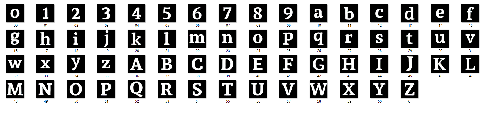

# Logo_Generator
## 前置動作
1. 在資料夾建立`texture_style`的資料夾。
2. Pretrained checkpoints (at epoch 600) can be found in [Google Drive](https://drive.google.com/drive/folders/1wpfvpv37ja2e5zpUvfU_YT1AQHhaUZN5?usp=sharing). 下載完後放進`./experiments/base_model/checkpoints`。
3. Download the Chinese embeddings from [Chinese-Word-Vectors](https://github.com/Embedding/Chinese-Word-Vectors), i.e., sgns.baidubaike.bigram-char, put it under `./dataset/Embeddings`.
4. Download the pre-trained auto-encoder models from this [google drive](https://drive.google.com/file/d/13n_YJ6J8lIvF-liWFeJY35nXsZM-5vTZ/view?usp=sharing). Unzip and place them at path `./texture_models/`.
5. 將字體圖片(數字及字母大小寫共62張圖，如下圖)，放進`./text_image`。

	 

6. 結果會存在於 `./outputs`。

---

## 執行指令:

`python test.py --mode test --input_text AbXx159 --style texture_style/style/glyh-paint.png --style_sem texture_style/style/glyh-sem.png`

---

## Options:

**主要更改參數**

- `--input_text` : 輸入字串(僅數字及字母大小寫)。
- `--style` : 材質檔案位置。
- `--style_sem` : 材質黑白圖檔案位置。
- `--output_size` : 結果圖大小(建議512以上)。
- `--test_sample_times` : 執行次數(預設為10)。